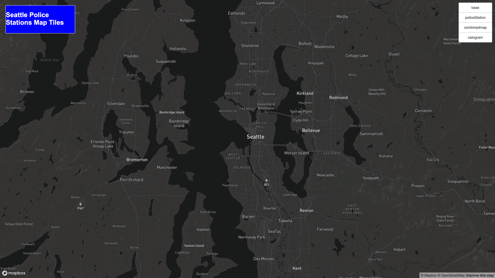
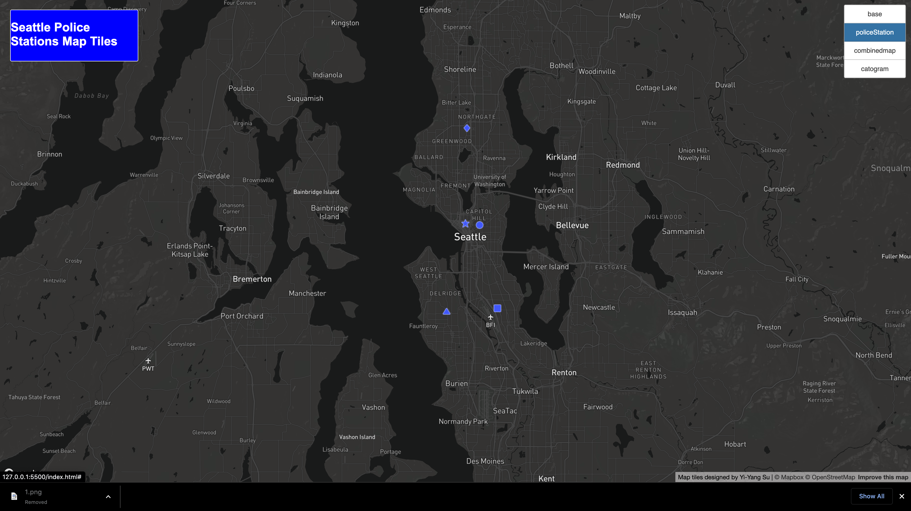
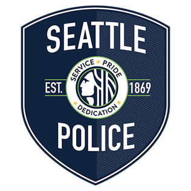
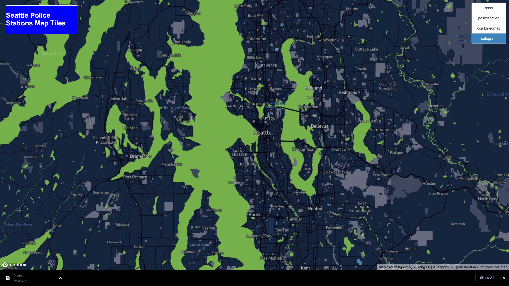

# Lab 4: Map Design and Tile Generation

**Author:** Yi-Yang Su

## Introduuction
[The Map](https://ivansu1999.github.io/Sea_Police_Station_tiles/index.html)

## 1. Map Layer1
### Discription:
This map layer is a monochrome map style which is originally dark map disigned by the Mapbox team. In order to create our own base map style, we utilized the mapbox studio to create a new base map. The changes been done are:
    - Adjust the base color to blue.
    - Adjust the road color to yellow.
    - Adjust the words font of places.

### Settings:
1. Map in Seattle Area.
2. Min zoom: 9
3. Max zoom: 11

## 2. Map Layer2
This map layer is the data points of the topic, Seattle Police Stations. The dots represents the location of the police Station. The background of the layer is transparent which we could see the data on the base map layers selected.

### Settings:
1. Map data only in Seattle Area.
2. Min zoom: 9
3. Max zoom: 11
4. Different shape of the points represents different departments.

## 3. Map Layer3
This map layer is the combination of the two previous map layers, whcih shows the police stations on our own designed base map.

### Settings:
1. Map data only in Seattle Area.
2. Min zoom: 9
3. Max zoom: 11

## 4. Map Layer4
This map layer is the topic map using photo searching, and create a colored map style from the system. The generating machine we utilized is [Catogram](https://apps.mapbox.com/cartogram/#11.82/40.71858/-73.97763). By inputing the Seattle police bedge, we receive the blue green style map and output the style into tiles map by QGIS.

## Resourse:
- [mapbox style](https://studio.mapbox.com/)
- [mapbox catogram](https://apps.mapbox.com/cartogram/#11.82/40.71858/-73.97763)
- [Seattle Open Data](https://data.seattle.gov/)
